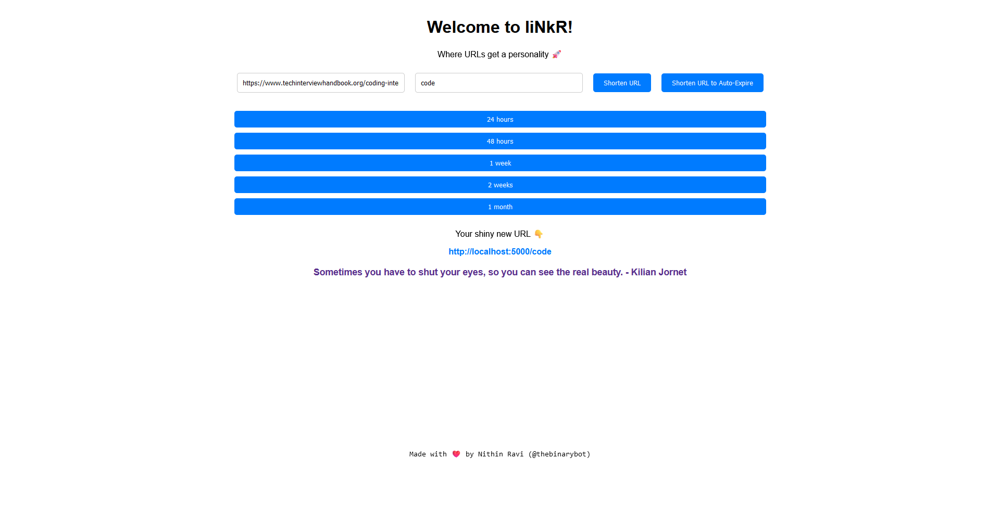

# Linkr - The modern URL link shortner



## Overview

**Linkr** is a user-friendly URL shortening application with an advanced auto-expire and custom slug feature. This project provides a seamless way to shorten URLs and set expiration timers for enhanced control over link validity. 

---

## Features

- 🌐 **Shorten URLs**: Generate short links quickly and easily.
- 🗞️ **Custom Slug**: Add your custom slug to the shortned link.
- ⏱️ **Auto-Expire URLs**: Set expiration timers (e.g., 24 hours, 2 weeks) for temporary links.
- 💡 **Dynamic Timer Options**: Display timer options dynamically based on user interaction.
- 🖼️ **User-Friendly Interface**: Clean and minimalistic UI for an effortless experience.

---

## Installation & Setup

To run this project locally, follow the steps below:

### Prerequisites
- Node.js (v16.x or later)
- npm or yarn

### Steps
1. **Clone the Repository**
   ```bash
   git clone https://github.com/thebinarybot/linkr.git
   cd linkr
   ```

2. **Install Dependencies**
   ```bash
   npm install
   ```

3. **Start the Development Server**
   ```bash
   npm start
   ```

4. **Access the Application**
   Open your browser and navigate to `http://localhost:3000`.

---

## Usage

1. **Shorten a URL**:
   - Enter the URL in the input field.
   - Click the "Shorten URL" button.
   - Your shortened URL will appear below.

2. **Shorten with Expiry**:
   - Click the "Shorten URL to Auto-Expire" button.
   - Select a timer option.
   - The shortened URL with the selected expiration time will appear below.

---

## Technologies Used

- **Frontend**: React.js
- **Styling**: CSS
- **Build Tools**: Webpack, Babel
- **Utilities**: Node.js

---

## Future Enhancements

- 🔐 **Authentication**: Add user authentication for personalized link management.
- 📊 **Analytics**: Provide click analytics for shortened links.
- 🌍 **Custom Domains**: Allow users to shorten URLs with their custom domains.

---

## Current To-Dos:

- [] Dockerize App
- [] Dark Mode
- [] Add a button to copy the shortened URL with one click/
- [] QR for Shortner !?

---

## Why did I build this?

I find myself reading articles, watching videos and more in multiple devices connected to the same network. I used to share these links via WhatsApp or other modes to other devices but that felt time consuming and for really good articles I need them stored persistently in a way I can remember. Thus, the localhost link shortner. 

---

## Contributing

Contributions are welcome! To contribute:

1. Fork the repository.
2. Create a new branch: `git checkout -b feature-name`.
3. Commit your changes: `git commit -m 'Add new feature'`.
4. Push to the branch: `git push origin feature-name`.
5. Submit a pull request.

---

## License

This project is licensed under the [MIT License](./LICENSE).

---

## Contact

- **Author**: Nithin Ravi [@thebinarybot](https://github.com/thebinarybot)
